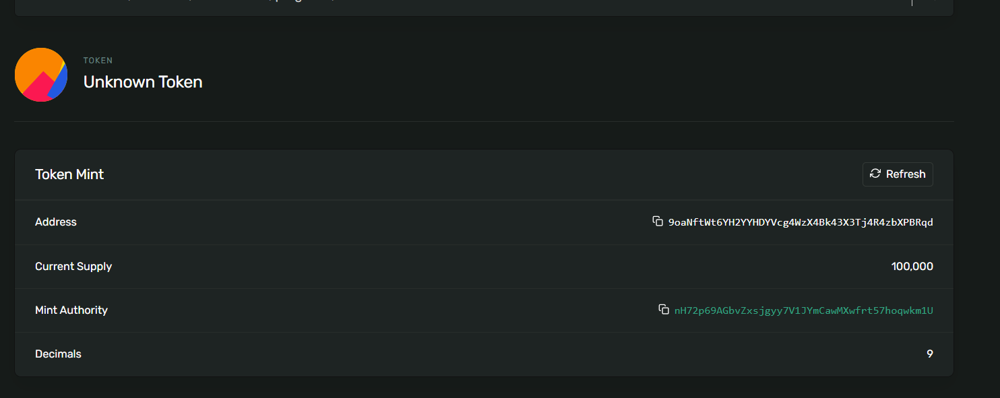

# Solana_Module_3
- Simple Project where the candyMachine is deploy with Nfts collection where the NFTs can be minted using the custom spl-token .

Public key :nH72p69AGbvZxsjgyy7V1JYmCawMXwfrt57hoqwkm1U

## Steps to Create a SPL-TOKEN

- 1.Create a token using `spl-token create-token`.
- 2.Create a token account using `spl-token create-account`
-  `Token Account :6TK1T1JwPQLVMDX4z69h6fg6MYCGHK6oKZVpUgZWdY8f`
-  ` Token Address : 9oaNftWt6YH2YYHDYVcg4WzX4Bk43X3Tj4R4zbXPBRqd `

## CandyMachine UI to Mint NFT using SPL-TOKEN
 -  "candyMachine": "KpcYnakbDDR7x1g8VwcUMTJwbnAqyn7H3b79HHPHcmY",

- `git Clone : https://github.com/metaplex-foundation/candy-machine-ui.git`
- `npm install : To install all dependencies.`
- `npm run start : To start application on localhost.`
- `Click on mint button : To mint NFT to connect wallet after approving the transaction by clicking confirm button.`

# Notes 
- The CandyMachine is deployed on to devnet solana RPC
